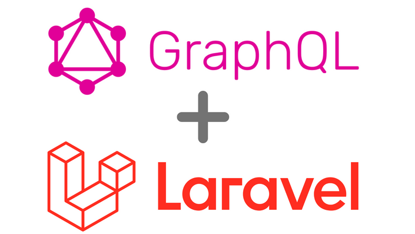
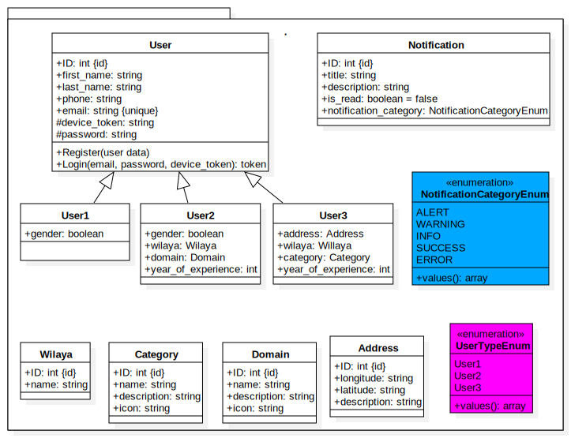

<p align="center">
  <a href="https://laravel.com" target="_blank">
    
  </a>
</p>

## About the Project
**Laravel-GraphQL-exercises** is a personal project designed for mastering GraphQL integration within Laravel applications. Leveraging the Laravel framework alongside the powerful Lighthouse package, this project serves as an immersive sandbox environment for refining GraphQL skills and implementing hands-on exercises. By constructing and refining GraphQL API endpoints, developers can solidify their grasp on GraphQL concepts, schema design, and query execution techniques. This project offers a practical platform for developers to experiment with GraphQL features and elevate their proficiency in harnessing GraphQL capabilities within the Laravel ecosystem.

### Technologies Utilized:
- [Laravel](https://laravel.com/)
- [PHP](https://www.php.net/)
- [GraphQL](https://graphql.org/)
- [Lighthouse](https://lighthouse-php.com/)
- [MySQL](https://www.mysql.com/)

## Project Design


The class diagram above illustrates the classes created in this project and their relationships.

## Getting Started
To utilize this project, follow these steps:

1. **Clone the Repository**: 
    ```bash
    git clone <repository_url>
    ```
2. **Install Composer Dependencies**: 
    ```bash
    cd laravel-graphql-exercises
    composer install
    ```
3. **Configure Environment Variables**: 
    ```bash
    cp .env.example .env
    ```
    Update the values in the `.env` file according to your preferences.
4. **Generate Application Key**: 
    ```bash
    php artisan key:generate
    ```
5. **Run Database Migrations**: 
    ```bash
    php artisan migrate
    ```
6. **Start the Application**: 
    ```bash
    php artisan serve
    ```
7. **Access GraphQL Playground**: 
    Open your web browser and navigate to:
    ```
    http://127.0.0.1:8000/graphiql
    ```

    Please note that `127.0.0.1:8000` is the default address and port for the Laravel development server. Adjust the URL if you've configured a different address or port.

### Additional Tips
- **Customization**: Customize the GraphQL schema, models, controllers, and routes to fit your project requirements.
- **Learn More**: Explore the official documentation of Laravel, GraphQL, Lighthouse, PHP, and MySQL for deeper insights and advanced features.
- **Security**: Prioritize application security by adhering to Laravel's security best practices and recommendations.

Follow these steps to have your Laravel GraphQL application up and running smoothly. Happy coding!
